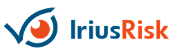
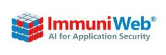
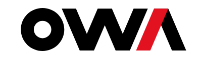
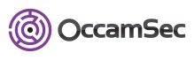
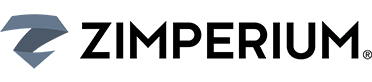

---

layout: col-sidebar
title: OWASP Baku
tags: example-tag
region: Asia
meetup-group:

---

  
## Welcome
  
  Welcome to the OWASP Baku chapter homepage. The chapter board is <a href="azar.alili@owasp.org"> Azar Alili </a> , <a href="https://www.linkedin.com/in/sabuhi-safarov-5958a5a2/)"> Sabuhi Safarov </a>, <a href="https://www.linkedin.com/in/sakhavat-suleymanli-cybersecurity-itaudit-information-security-s%C9%99xav%C9%99t-s%C3%BCleymanl%C4%B1/)"> Sakhavat Suleymanli </a> and <a href="https://www.linkedin.com/in/dadashguliyev/"> Dadash Guliyev </a>. Follow chapter news on <a href="fb.com"> Facebook </a> | <a href="twitter.com"> Twitter </a> | <a href="meetup.com"> Meetup.com  </a>| <a href="eventbrite.com"> EventBrite </a> | <a href="linkedin.com"> LinkedIN . </a> Watch recordings of past talks on our <a href="youtu.be"> YouTube Channel </a>

The Open Web Application Security Project (OWASP) is a non-profit organization working to improve software security. All of our projects, tools, documents, forums, and chapters are free and open to anyone interested in improving application security. Our mission is to enrich the comunity of application security community in the region- Baku.

  
  
## Chapter Supporters
The following are the list of OWASP Corporate Members who have generously aligned themselves with the London chapter, therefore contributing funds to our chapter:
<table cellpadding="15" cellspacing="0">
<tr>
<td>

</td>
<td>

</td>
<td>
  

</td>
</tr>
<tr>
<td>
  

</td>
<td>

</td>
<td>
  
</td>
</tr>
<tr>
<td>
  
</td>
<td>
  

</td>
<td>
  
</td>
</tr>

<tr>
<td>
  
</td>
<td>
  
</td>
<td>
  
</td>  
</tr>

<tr>
  <td>
   
  </td>
  <td>
    
  </td>
   <td>
       
    </td>

</tr>
  
  <tr>
  <td>
   
  </td>
  <td>
    
  </td>
   <td>
       
    </td>

</tr>
</table>
  
  

## Speaking at OWASP Baku Chapter Events

<h4>Call For Speakers</h4>

Call For Speakers is open - if you would like to present a talk on Application Security at future OWASP Baku Chapter events - please review and agree with the <a href="https://owasp.org/www-policy/legal/speaker-agreement"> OWASP Speaker Agreement </a> and send the proposed talk title, abstract and speaker bio to the Chapter Leaders via e-mail:

<code class="language-plaintext highlighter-rouge">owaspbaku (at) owasp.org</code>

<h2 id="next-meetingevents">Next Meeting/Event(s)</h2>

OWASP Baku Chapter meetings are posted on our MeetUp Page:

Please visit <a href="https://www.meetup.com/OWASP-Baku">http://www.meetup.com/OWASP-Baku</a> OWASP Baku MeetUp site for Baku Chapter event information.

<h2 id="video-recordings-of-past-events">Video Recordings of Past Events</h2>

You can watch the recordings of talks presented at OWASP Baku events on our YouTube channel: https://www.youtube.com/OWASPBaku

Please <a href="https://www.youtube.com/OWASPBaku?sub_confirmation=1">SUBSCRIBE</a> to our YouTube channel to get notified when new videos get published.

<h2 id="updates-on-social-media-and-mailing-list">Updates on Social Media and Mailing List</h2>

Please follow OWASP Baku Chapter on <a href="https://twitter.com/OWASPBaku">Twiter</a>/<a href="https://facebook.com/OWASPBaku">Facebook</a>/<a href="https://meetup.com/OWASP-Baku">MeetUp</a>/<a href="https://owaspbaku.eventbrite.com">EventBrite</a>/<a href="https://www.linkedin.com/company/owaspbaku">LinkedIN</a> and <a href="https://groups.google.com/a/owasp.org/forum/#!forum/baku-chapter/join">sign up to our mailing list</a> to be notified about the upcoming OWASP Baku Chapter events.

