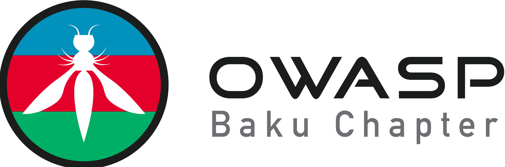

---

layout: col-sidebar
title: OWASP Baku
tags: owasp, baku, azerbaijan
region: Asia
country: Azerbaijan
meetup-group: owasp-baku-chapter

---

  
 
Welcome to OWASP-Baku Chapter. The chapter board are Azar Alili, Dadash Guliyev, and Hajiahmad Ahmadzada.   

Follow chapter news on <a href="https://twitter.com/OWASPBAKU"> Twitter </a> | <a href="https://www.linkedin.com/company/owasp-baku/about/?viewAsMember=true"> LinkedIN </a>

OWASP is a non-profit organization to improve apllication security. All of our projects, tools, documents, forums, and chapters are free and open to anyone interested in improving application security. Our mission is to enrich the comunity of application security community in the region-Baku.  
The OWASP Baku Chapter, led by founding member and cybersecurity experts, has been instrumental in shaping the landscape of application security in the region. Through its initiatives and collaborations, the chapter has significantly enhanced awareness and knowledge of cybersecurity practices among developers, businesses, and organizations. our crucial contribution to the chapter's activities, including organizing workshops, seminars, and conferences, has empowered professionals to adopt best practices in application security. The chapter's efforts have not only strengthened cybersecurity measures locally but have also had a ripple effect across Eastern Europe, the Middle East, and Central Asia, highlighting its impactful influence in advancing cybersecurity standards and strategies in the region.
Other founding members who holds certifications like OSEP, OSWE, OCED, OSCE3 and OSCP certified professional, also play key leadership roles within the community. They contribute to the community's innovative security support efforts, raising awareness about cybersecurity's significance and fostering a culture of proactive security measures.
Azar Alili is a seasoned cybersecurity professional with unique experaice and knowledge with over 17 years of experience spanning various sectors and specializing in areas like digital forensics, data privacy, app-sec, SOC and risk management. He demonstrates leadership in crafting cybersecurity strategies and has a background in diverse industries. Actively involved in the cybersecurity community, Mr. Alili is an organizer for the OWASP Baku Chapter and is dedicated to education through upcoming training programs. His research collaborations include work with Guman Garayev on the topic of <a href="https://www.preprints.org/manuscript/202404.1313/v1"> Quantum Key Distribution (QKD) security </a> . He shares his expertise through a blog and has been recognized as a tech influencer. Academically, Alili has studied informatic and cybersecurity. 

<h4>Call For Speakers</h4>

Call For Speakers is open - if you would like to present a talk on Application Security at future OWASP Baku Chapter events - please review and agree with the OWASP Speaker Agreement and send the proposed talk title, abstract and speaker bio to the Chapter Leaders via <a href="mailto:dadash.guliyev@owasp.org"> e-mail </a> :

<h2 id="next-meetingevents">Next Meeting/Event(s)</h2>

OWASP Baku Chapter meetings are posted on our MeetUp Page:
 
Please visit <a href="https://www.meetup.com/owasp-baku-chapter/"> our next meeting </a>. 

<h2 id="video-recordings-of-past-events">Video Recordings of Past Events</h2>

You can watch the recordings of talks presented at OWASP Baku events on our YouTube channel.

<h2 id="updates-on-social-media-and-mailing-list">Updates on Social Media and Mailing List</h2>

Please follow OWASP Baku Chapter on our social accounts 

<h3 id="baku-information">Baku Information</h3>
<ul>
  <li><a href="https://www.owasp.org/index.php/Membership">Become a Member</a></li>
  <li><a href="https://groups.google.com/all-groups">Join Our Mailing List</a></li>
  <li><a href="https://owasp.org/donate">Local Chapter Support</a></li>
  <li><a href="https://owasp.org/www-policy/legal/speaker-agreement">Speaker Agreement</a></li>
  <li><a href="https://github.com/OWASP/www-chapter-baku/blob/main/owasp_baku_bylaw.md">OWASP Baku Chapter Bylaw</a></li>
  <li><a href="https://owasp.org/www-policy/operational/conferences-events.html">Code of Conduct</a></li>
</ul>

<h3 id="social-links">Social Links</h3>
<ul>
  <li><a href="https://twitter.com/OWASPBAKU">Twitter</a></li>
  <li><a href="https://www.linkedin.com/company/owasp-baku">Linkedin</a></li>
  <li><a href="https://www.meetup.com/owasp-baku-chapter/"> Meetup</a></li>
</ul>
