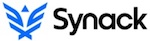
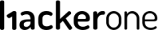
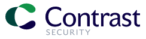

---

layout: col-sidebar
title: OWASP Baku
tags: example-tag
region: Asia
meetup-group:

---

<div style='color:red;'>

Welcome to the OWASP Baku chapter homepage. The chapter board is <a href="azar.alili@owasp.org"> Azar Alili </a> , <a href="https://www.linkedin.com/in/sabuhi-safarov-5958a5a2/)"> Sabuhi Safarov </a> and <a href="https://www.linkedin.com/in/sakhavat-suleymanli-cybersecurity-itaudit-information-security-s%C9%99xav%C9%99t-s%C3%BCleymanl%C4%B1/)"> Sakhavat Suleymanli </a>. Follow chapter news on <a href="fb.com"> Facebook </a> | <a href="twitter.com"> Twitter </a> | <a href="meetup.com"> Meetup.com  </a>| <a href="eventbrite.com"> EventBrite </a> | <a href="linkedin.com"> LinkedIN . </a> Watch recordings of past talks on our <a href="youtu.be"> YouTube Channel </a>


## Welcome
Hello Baku. The Open Web Application Security Project (OWASP) is a non-profit organization working to improve software security. All of our projects, tools, documents, forums, and chapters are free and open to anyone interested in improving application security. Our mission is to enrich the comunity of application security community in the region- Baku.

  
  
## Chapter Supporters
The following are the list of OWASP Corporate Members who have generously aligned themselves with the London chapter, therefore contributing funds to our chapter:

  
  <table cellpadding="15" cellspacing="0">
<tr>
<td>

<a href="https://www.veracode.com"></a>

</td>
<td>

<a href="https://www.thoughtworks.com"></a>

</td>
<td>
  <a href="https://www.iedigital.com"></a>


</td>
</tr>
<tr>
<td>
  <a href="https://www.netsparkers.com"></a>

</td>
<td>


</td>
<td>
  <a href="https://www.synack.com"></a>
</td>
</tr>
<tr>
<td>
  <a href="https://www.iriusrisk.com"></a>
</td>
<td>
  <a href="https://www.hackerone.com"></a>

</td>
<td>
  <a href="https://www.immuniweb.com"></a>
</td>
</tr>

<tr>
<td>
  <a href="https://www.owadigital.co.uk"></a>
</td>
<td>
  <a href="https://www.facebook.com"></a>
</td>
<td>
  <a href="https://www.avatao.com"></a>
</td>  
</tr>

<tr>
  <td>
   <a href="https://www.apriorit.com"></a>
  </td>
  <td>
    <a href="https://www.occamsec.com"></a>
  </td>
   <td>
       <a href="https://www.kiuwan.com"></a>
    </td>

</tr>
  
  <tr>
  <td>
   <a href="https://www.specialistdata.com/"></a>
  </td>
  <td>
    <a href="https://www.contrastsecurity.com/"></a>
  </td>
   <td>
       <a href="https://zimperium.com"></a>
    </td>

</tr>
</table>
  
  
</div>

## Speakers & Supporters
All of our projects ,tools, documents, forums, and chapters are free and open to anyone interested in improving application and software security.
Please contact <a href="azar.alili@owasp.org"> Azar Alili </a> if you would like to present at one of our chapter meetings, or if you have some virtual resources to donate (e.g., CTF ranges, online training, etc.).

Chapters are led by local leaders in accordance with the [Chapters Policy](/www-policy/operational/chapters). Financial contributions should only be made online using the authorized online donation button. 

Everyone is welcome and encouraged to participate in our [Projects](/projects/), [Local Chapters](/chapters/), [Events](/events/), [Online Groups](https://groups.google.com/a/owasp.com/){:target='_blank'}, and [Community Slack Channel](https://owasp.slack.com/){:target='_blank'}. We especially encourage diversity in all our initiatives. OWASP is a fantastic place to learn about application security, to network, and even to build your reputation as an expert. We also encourage you to be [become a member](/membership/) or consider a [donation](/donate/) to support our ongoing work.

Next Meeting/Event <!-- You should keep this section as it will populate your meetup events -->
---------------------


<!-- You should delete this comment

Standard Chapter Page Template
This is an example of a Project or Chapter page.
Please change these items to indicate the actual information you wish to present. In addition to this information, the 'front-matter' above the text should be modified to reflect your actual information.  An explanation of each of the front-matter items is below:

{front matter for this file}

```
- layout: This is the layout used by project and chapter pages.  You should leave this value as col-sidebar
- title: This is the title of your project or chapter page, usually the name.  For example, OWASP Zed Attack Proxy or OWASP Baltimore
- tags: This is a space-delimited list of tags you associate with your project or chapter.  If you are using tabs, at least one of these tags should be unique in order to be used in the tabs files (an example tab is included in this repo) 
- region: This is the region you are in according to our data
```

{copy for this file (index.md)}
Replace the text above the commented area with your information in the format below:
```
## Welcome
Include some information here about your chapter

## Participation
The Open Web Application Security Project (OWASP) is a nonprofit foundation that works to improve the security of software. All of our projects ,tools, documents, forums, and chapters are free and open to anyone interested in improving application security. 

Chapters are led by local leaders in accordance with the [Chapter Leader Handbook](/www-policy/rules-of-procedure/chapter-handbook). Financial contributions should only be made online using the authorized online donation button. To be a SPEAKER at ANY OWASP Chapter in the world simply review the [speaker agreement](/www-policy/speaker-agreement) and then contact the local chapter leader with details of what OWASP Project, independent research, or related software security topic you would like to present.

Everyone is welcome and encouraged to participate in our [Projects](/projects), [Local Chapters](/chapters), [Events](/events), [Online Groups](https://groups.google.com/a/owasp.com/){:target='_blank'}, and [Community Slack Channel](https://owasp.slack.com/){:target='_blank'}. We especially encourage diversity in all our initiatives. OWASP is a fantastic place to learn about application security, to network, and even to build your reputation as an expert. We also encourage you to be [become a member](/membership) or consider a [donation](/donate) to support our ongoing work.

## Next Meeting/Event
---------------------




```
{info.md}

This separate file is where you should place links to your Google Group and Meetup page. It will be automatically rendered in the column sidebar.

{leaders.md}

Another separate file that should simply include each leaders name with mailto link as a list. It will also be automatically rendered in the column sidebar.

-->
